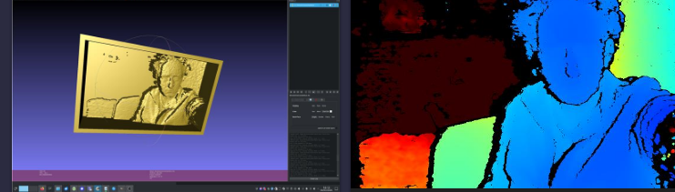

# depthmap-to-basrelief
Using ETH-Zurich Hugging Face (Marigold) code, transform false-colour (hue-encoded) depth maps to in-principle-printable bas-reliefs

Source of ETH-Zurich 'Depth to 3d Print' https://huggingface.co/spaces/prs-eth/depth-to-3d-print

Other than the bas-relief extrusion, this is based on the Realsense depth image compression documentation: 
https://dev.realsenseai.com/docs/depth-image-compression-by-colorization-for-intel-realsense-depth-cameras

and on the C code for depth image recovery from colorized depth images given there. It's slightly arbitrarily set in terms of greyscale image (essentially, it's what I thought looked good in a print), so that may be something I'll look at later. 

The point of this is illustrative - it can be hard to see what information is actually captured in a colorised depth image and that's not ideal in terms of accessibility/consent. 

Example of use:

python depthimagetobasrelief.py --depthPath librealsenseexampleface.png  --output librealsenseexampleface-output.png --output-inverted librealsenseexampleface-invout.png --make_bas_relief --output-basrelief librealsenseexampleface-basrelief

